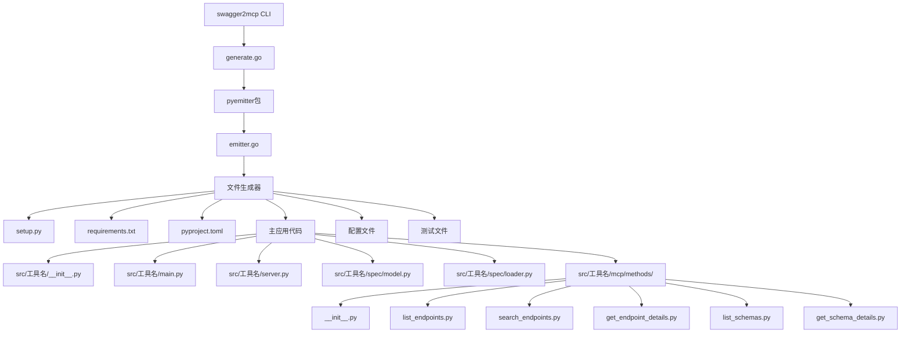
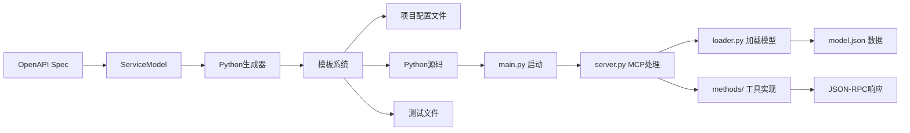
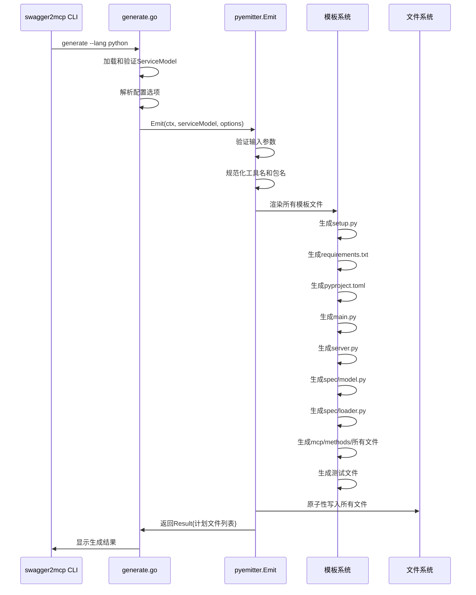
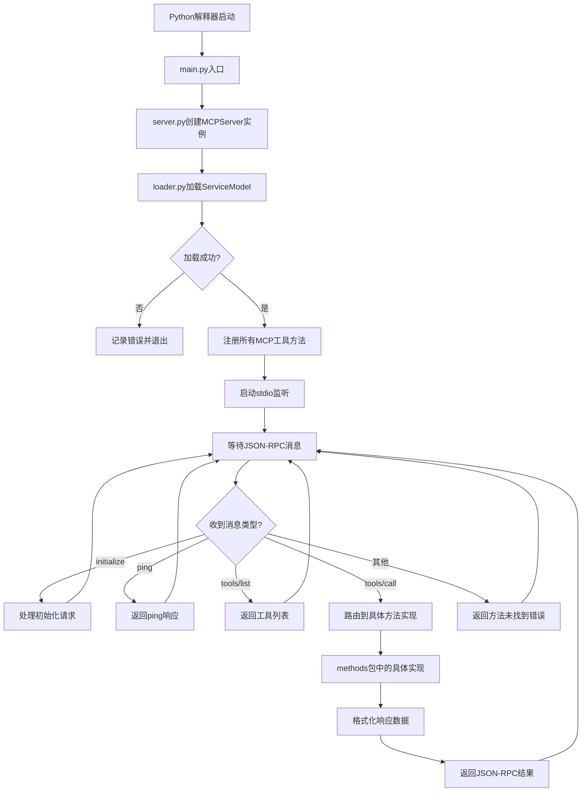
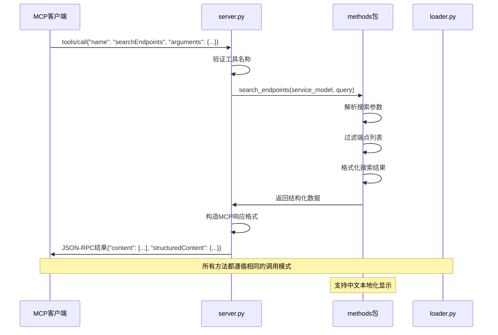

# Python3 代码生成器设计文档

## 概述

本设计文档定义了在 swagger2mcp 工具中新增 Python3 代码生成器的技术实现方案。该生成器将扩展现有工具的能力，支持生成符合 MCP（Model Context Protocol）规范的 Python 服务器项目，与现有的 Go 和 Node.js 生成器保持架构一致性。

### 设计目标

1. **架构一致性**：遵循现有 goemitter 和 npmemitter 的设计模式
2. **现代 Python 实践**：支持 Python 3.8+ 版本，使用现代 Python 开发工具链
3. **MCP 协议兼容**：完全实现 MCP 协议规范，支持 JSON-RPC 2.0
4. **高质量代码**：生成符合 PEP 8 规范的高质量 Python 代码
5. **开发体验**：提供完整的开发环境配置和工具支持

### 功能范围

- 生成完整的 Python MCP 服务器项目
- 支持所有标准 MCP 工具方法（listEndpoints、searchEndpoints、getEndpointDetails、listSchemas、getSchemaDetails）
- 提供中文本地化显示支持
- 包含完整的开发工具链配置（格式化、类型检查、测试）
- 支持项目打包和分发

## 架构设计

### 系统架构图



### 目录结构

```
生成的Python项目/
├── setup.py                    # 项目安装配置
├── requirements.txt             # 运行时依赖
├── requirements-dev.txt         # 开发依赖
├── pyproject.toml              # 现代Python项目配置
├── Makefile                    # 开发任务管理
├── README.md                   # 项目文档
├── .gitignore                  # Git忽略规则
├── .editorconfig              # 编辑器配置
├── src/
│   └── [工具名]/
│       ├── __init__.py         # 包初始化
│       ├── main.py             # 程序入口点
│       ├── server.py           # MCP服务器实现
│       ├── spec/
│       │   ├── __init__.py
│       │   ├── model.py        # 数据模型定义
│       │   ├── loader.py       # 模型加载器
│       │   └── model.json      # 嵌入的服务模型
│       └── mcp/
│           ├── __init__.py
│           └── methods/
│               ├── __init__.py
│               ├── list_endpoints.py
│               ├── search_endpoints.py
│               ├── get_endpoint_details.py
│               ├── list_schemas.py
│               └── get_schema_details.py
└── tests/
    ├── __init__.py
    └── test_mcp_methods.py     # 方法测试
```

### 数据流图



## 组件设计

### pyemitter包

**职责：**
- 实现 Emit 函数接口，与现有 goemitter/npmemitter 保持一致
- 生成完整的 Python MCP 项目文件结构
- 处理模板渲染和文件写入

**接口：**
```go
type Options struct {
    OutDir      string // 必需；目标输出目录
    ToolName    string // 工具名称；用于项目和包命名
    PackageName string // Python包名；默认为工具名的规范化版本
    Force       bool   // 覆盖现有文件
    DryRun      bool   // 仅计划，不实际写入
    Verbose     bool   // 详细输出
}

type PlannedFile struct {
    RelPath string
    Size    int
    Mode    os.FileMode
}

type Result struct {
    ToolName    string
    PackageName string
    Planned     []PlannedFile
}

func Emit(ctx context.Context, sm *genspec.ServiceModel, opts Options) (*Result, error)
```

**依赖：**
- internal/spec（ServiceModel定义）
- 标准库：context、encoding/json、fmt、os、path/filepath等

### Python MCP 服务器组件

#### main.py - 程序入口
**职责：**
- 作为控制台脚本入口点
- 初始化 MCP 服务器
- 处理命令行参数和配置
- 启动标准输入输出协议监听

#### server.py - MCP 服务器核心
**职责：**
- 实现 MCP 协议的 JSON-RPC 2.0 处理
- 处理 initialize、ping、tools/list、tools/call 等标准方法
- 管理工具注册和调用路由
- 错误处理和日志记录

#### spec/loader.py - 服务模型加载器
**职责：**
- 从嵌入的 model.json 文件加载服务模型
- 提供数据访问接口
- 处理加载错误和异常情况

### MCP 方法实现组件

每个方法组件都提供特定的 API 查询功能，支持中文本地化显示。

#### list_endpoints.py
**职责：**
- 提供 API 概览和统计信息
- 格式化端点列表显示
- 支持按方法、标签、路径分类统计

#### search_endpoints.py
**职责：**
- 支持关键字、标签、方法、路径模式搜索
- 提供搜索结果格式化
- 实现正则表达式路径匹配

#### get_endpoint_details.py
**职责：**
- 通过 ID 或 method+path 查找端点详情
- 解析和显示 Schema 引用
- 格式化参数、请求体、响应信息

#### list_schemas.py
**职责：**
- 列出所有可用的 Schema
- 提供 Schema 摘要信息

#### get_schema_details.py
**职责：**
- 获取指定 Schema 的详细信息
- 递归解析 Schema 引用
- 格式化复杂数据结构显示

## 数据模型

### 核心数据结构定义

```python
from dataclasses import dataclass
from typing import List, Dict, Optional, Any, Union
from enum import Enum

class HttpMethod(str, Enum):
    GET = "get"
    POST = "post"
    PUT = "put"
    DELETE = "delete"
    PATCH = "patch"
    HEAD = "head"
    OPTIONS = "options"
    TRACE = "trace"

@dataclass
class Server:
    url: str
    description: str

@dataclass
class ServiceModel:
    title: str
    version: str
    description: str
    servers: List[Server]
    tags: List[str]
    endpoints: List['EndpointModel']
    schemas: Dict[str, 'Schema']

@dataclass
class EndpointModel:
    id: str  # method+path
    method: HttpMethod
    path: str
    summary: str
    description: str
    tags: List[str]
    parameters: List['ParameterModel']
    request_body: Optional['RequestBodyModel']
    responses: List['ResponseModel']

@dataclass
class ParameterModel:
    name: str
    in_: str  # path|query|header|cookie
    required: bool
    schema: Optional['SchemaOrRef']

@dataclass
class RequestBodyModel:
    content: List['Media']
    required: bool

@dataclass
class ResponseModel:
    status: str  # 200, 4xx, default
    description: str
    content: List['Media']

@dataclass
class Media:
    mime: str
    schema: Optional['SchemaOrRef']
    example: Any

@dataclass
class Schema:
    name: str
    type: str
    properties: Optional[Dict[str, 'SchemaOrRef']]
    required: Optional[List[str]]
    items: Optional['SchemaOrRef']
    all_of: Optional[List['SchemaOrRef']]
    any_of: Optional[List['SchemaOrRef']]
    one_of: Optional[List['SchemaOrRef']]
    description: str
    enum: Optional[List[Any]]
    format: Optional[str]
    example: Any

@dataclass
class SchemaRef:
    ref: str

@dataclass
class SchemaOrRef:
    schema: Optional[Schema] = None
    ref: Optional[SchemaRef] = None
```

### 数据模型图

```mermaid
classDiagram
    class ServiceModel {
        +str title
        +str version
        +str description
        +List~Server~ servers
        +List~str~ tags
        +List~EndpointModel~ endpoints
        +Dict~str,Schema~ schemas
    }
    
    class EndpointModel {
        +str id
        +HttpMethod method
        +str path
        +str summary
        +str description
        +List~str~ tags
        +List~ParameterModel~ parameters
        +RequestBodyModel request_body
        +List~ResponseModel~ responses
    }
    
    class Schema {
        +str name
        +str type
        +Dict~str,SchemaOrRef~ properties
        +List~str~ required
        +SchemaOrRef items
        +List~SchemaOrRef~ all_of
        +str description
        +List~Any~ enum
        +str format
        +Any example
    }
    
    class SchemaOrRef {
        +Schema schema
        +SchemaRef ref
    }
    
    ServiceModel ||--o{ EndpointModel : contains
    ServiceModel ||--o{ Schema : contains
    EndpointModel ||--o{ ParameterModel : has
    EndpointModel ||--o| RequestBodyModel : has
    EndpointModel ||--o{ ResponseModel : has
    Schema ||--o{ SchemaOrRef : references
    SchemaOrRef ||--o| Schema : points_to
```

## 业务流程

### 流程1: Python 代码生成器初始化和调用



### 流程2: MCP 服务器启动和运行



### 流程3: 工具方法调用处理



## 错误处理策略

### 分层错误处理

1. **生成器层面**
   - 输入参数验证失败
   - ServiceModel 为空或无效
   - 输出目录权限问题
   - 文件写入失败

2. **服务器层面**
   - JSON-RPC 解析错误
   - 方法未找到
   - 参数绑定失败
   - 内部服务错误

3. **方法实现层面**
   - 数据模型访问失败
   - Schema 引用解析错误
   - 正则表达式编译失败
   - 数据格式化异常

### 错误恢复机制

```python
# 示例：错误处理和恢复
import logging
from typing import Optional, Tuple, Any

logger = logging.getLogger(__name__)

def handle_tool_call(tool_name: str, arguments: dict) -> Tuple[bool, Any]:
    """处理工具调用，返回(成功标志, 结果或错误信息)"""
    try:
        if tool_name == "searchEndpoints":
            return True, search_endpoints_impl(arguments)
        elif tool_name == "listEndpoints":
            return True, list_endpoints_impl(arguments)
        else:
            return False, f"未知工具: {tool_name}"
    except ValueError as e:
        logger.warning(f"参数验证失败 - 工具: {tool_name}, 错误: {e}")
        return False, f"参数错误: {str(e)}"
    except Exception as e:
        logger.error(f"工具执行失败 - 工具: {tool_name}, 错误: {e}", exc_info=True)
        return False, f"内部错误: {str(e)}"
```

## 测试策略

### 测试层次结构

1. **单元测试**
   - 每个 MCP 方法的独立测试
   - 数据模型加载测试
   - 工具函数测试

2. **集成测试**
   - MCP 服务器完整启动测试
   - JSON-RPC 协议测试
   - 端到端工具调用测试

3. **生成器测试**
   - pyemitter.Emit 函数测试
   - 文件生成完整性测试
   - 模板渲染测试

### 测试实现示例

```python
# tests/test_mcp_methods.py
import pytest
from unittest.mock import Mock, patch
from src.myapp.spec.loader import load_service_model
from src.myapp.mcp.methods import (
    list_endpoints, search_endpoints, 
    get_endpoint_details, list_schemas, get_schema_details
)

class TestMCPMethods:
    @pytest.fixture
    def service_model(self):
        """提供测试用的ServiceModel"""
        return load_service_model()
    
    def test_list_endpoints_overview(self, service_model):
        """测试端点概览功能"""
        overview = list_endpoints.format_endpoints_overview(service_model)
        assert isinstance(overview, str)
        assert len(overview) > 0
        assert "API 接口概览" in overview
    
    def test_search_endpoints_keyword(self, service_model):
        """测试关键字搜索功能"""
        results = search_endpoints.search_endpoints(
            service_model, 
            {"keyword": "user", "tag": "", "method": "", "path_pattern": ""}
        )
        assert isinstance(results, list)
        # 验证搜索结果结构
        if results:
            result = results[0]
            assert "id" in result
            assert "method" in result
            assert "path" in result
    
    def test_schema_details_resolution(self, service_model):
        """测试Schema详情解析"""
        schemas = list_schemas.list_schemas(service_model)
        if schemas:
            schema_name = schemas[0]["name"]
            schema, found = get_schema_details.get_schema_details(
                service_model, schema_name
            )
            assert found
            assert schema is not None
            assert schema.name == schema_name
    
    def test_endpoint_details_by_id(self, service_model):
        """测试通过ID获取端点详情"""
        if service_model.endpoints:
            endpoint_id = service_model.endpoints[0].id
            endpoint, found = get_endpoint_details.get_endpoint_details(
                service_model, endpoint_id
            )
            assert found
            assert endpoint is not None
            assert endpoint.id == endpoint_id

    @pytest.mark.parametrize("method,path", [
        ("get", "/users"),
        ("post", "/users"),
        ("invalid", "/nonexistent"),
    ])
    def test_endpoint_details_by_method_path(self, service_model, method, path):
        """测试通过方法和路径获取端点详情"""
        endpoint, found = get_endpoint_details.get_endpoint_details(
            service_model, method, path
        )
        # 根据实际数据验证结果
        if any(ep.method.value == method and ep.path == path 
               for ep in service_model.endpoints):
            assert found
            assert endpoint is not None
        else:
            assert not found
```

### 性能测试

```python
# tests/test_performance.py
import time
import pytest
from src.myapp.spec.loader import load_service_model
from src.myapp.mcp.methods import search_endpoints

class TestPerformance:
    @pytest.fixture(scope="class")
    def service_model(self):
        return load_service_model()
    
    def test_search_performance(self, service_model):
        """测试搜索功能性能"""
        start_time = time.time()
        
        # 执行多次搜索
        for _ in range(100):
            search_endpoints.search_endpoints(
                service_model, {"keyword": "api"}
            )
        
        end_time = time.time()
        avg_time = (end_time - start_time) / 100
        
        # 平均搜索时间应小于10ms
        assert avg_time < 0.01, f"搜索性能过慢: {avg_time:.4f}s"
    
    def test_memory_usage(self, service_model):
        """测试内存使用情况"""
        import tracemalloc
        
        tracemalloc.start()
        
        # 执行内存密集操作
        for _ in range(1000):
            list_endpoints.format_endpoints_overview(service_model)
        
        current, peak = tracemalloc.get_traced_memory()
        tracemalloc.stop()
        
        # 峰值内存使用应小于50MB
        assert peak < 50 * 1024 * 1024, f"内存使用过高: {peak / 1024 / 1024:.2f}MB"
```

## 部署和集成

### CLI 集成更新

需要在 `internal/cli/generate.go` 中添加对 Python 的支持：

```go
// 在第60行附近更新help文档
flags.String("lang", "", "Target language to emit (go|npm|python); defaults to go")

// 在第189-196行更新验证逻辑
switch c.Lang {
case "", "go", "npm", "python":  // 添加python支持
    if c.Lang == "" {
        c.Lang = "go"
    }
default:
    return newUsageError(fmt.Sprintf("generate: unsupported --lang %q (allowed: go, npm, python)", c.Lang))
}

// 在runGenerate函数中添加python case（第305行后）
case "python":
    res, err := pyemitter.Emit(ctx, sm, pyemitter.Options{
        OutDir:      outDir,
        ToolName:    resolvedToolName,
        PackageName: strings.TrimSpace(cfg.PackageName),
        Force:       cfg.Force,
        DryRun:      cfg.DryRun,
        Verbose:     cfg.Verbose,
    })
    if err != nil {
        return wrapOutputError(err, absOut)
    }
    if cfg.DryRun {
        printPlan(absOut, len(res.Planned), func() []string {
            paths := make([]string, 0, len(res.Planned))
            for _, p := range res.Planned {
                paths = append(paths, p.RelPath)
            }
            return paths
        }())
    }
```

### 依赖管理

生成的Python项目将包含以下依赖配置：

**requirements.txt:**
```
# MCP协议支持（选择合适的库）
dataclasses-json>=0.6.0
typing-extensions>=4.5.0
```

**requirements-dev.txt:**
```
# 开发工具
black>=23.0.0
mypy>=1.5.0
pytest>=7.4.0
pytest-cov>=4.1.0
flake8>=6.0.0
isort>=5.12.0
```

**pyproject.toml:**
```toml
[build-system]
requires = ["setuptools>=61.0", "wheel"]
build-backend = "setuptools.build_meta"

[project]
name = "{{ package_name }}"
version = "0.1.0"
description = "Generated MCP tool for {{ service_title }}"
authors = [
    {name = "Generated by swagger2mcp"},
]
requires-python = ">=3.8"
dependencies = [
    "dataclasses-json>=0.6.0",
    "typing-extensions>=4.5.0",
]

[project.scripts]
"{{ tool_name }}" = "{{ package_name }}.main:main"

[tool.black]
line-length = 88
target-version = ['py38']

[tool.mypy]
python_version = "3.8"
strict = true
warn_return_any = true

[tool.pytest.ini_options]
testpaths = ["tests"]
python_files = ["test_*.py"]
python_classes = ["Test*"]
python_functions = ["test_*"]
```

设计文档看起来不错吗？如果满意，我们可以继续进行实现计划。