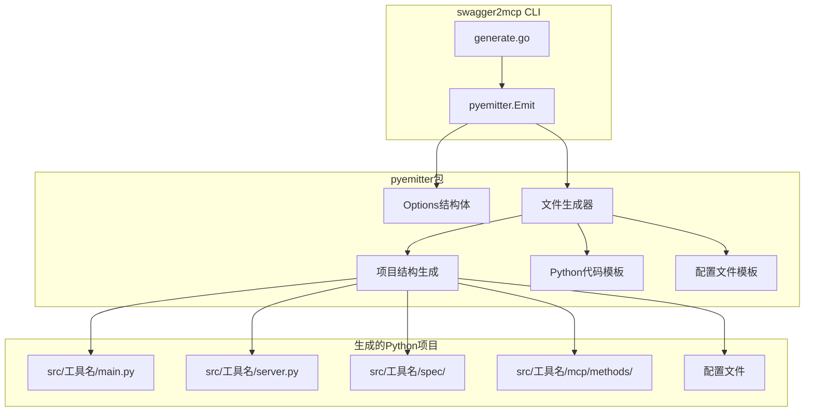
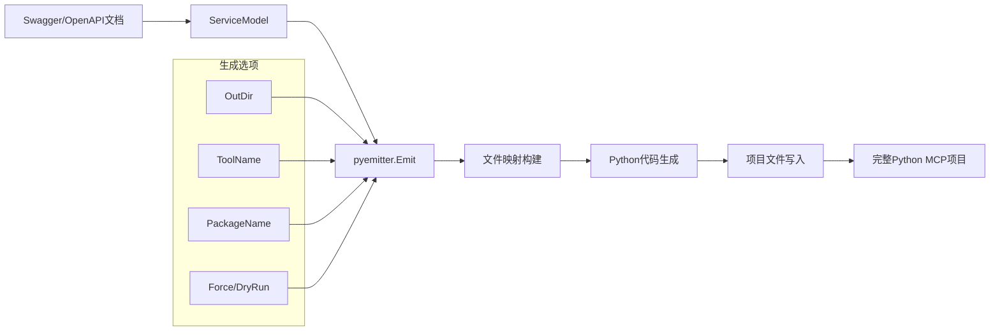
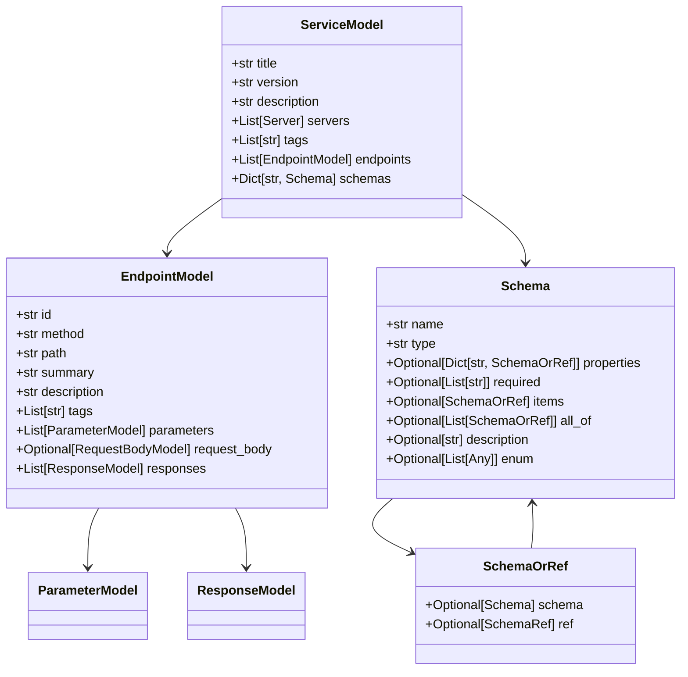
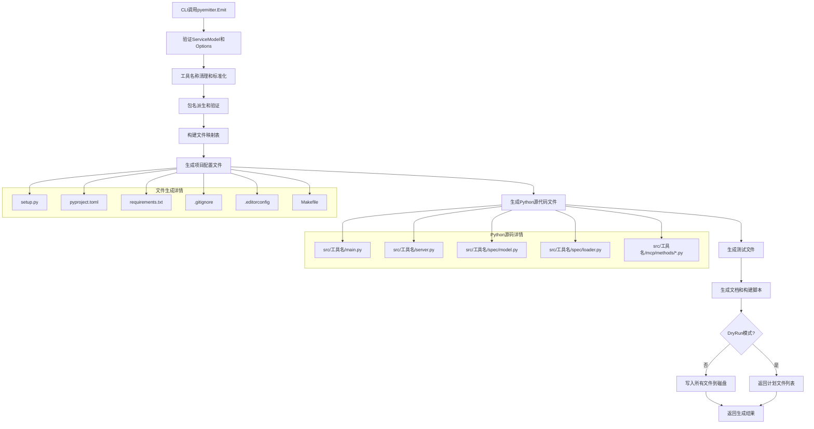
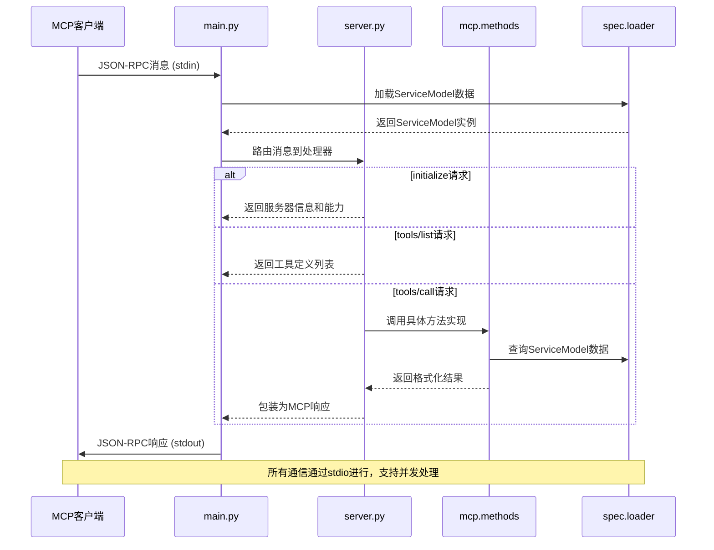
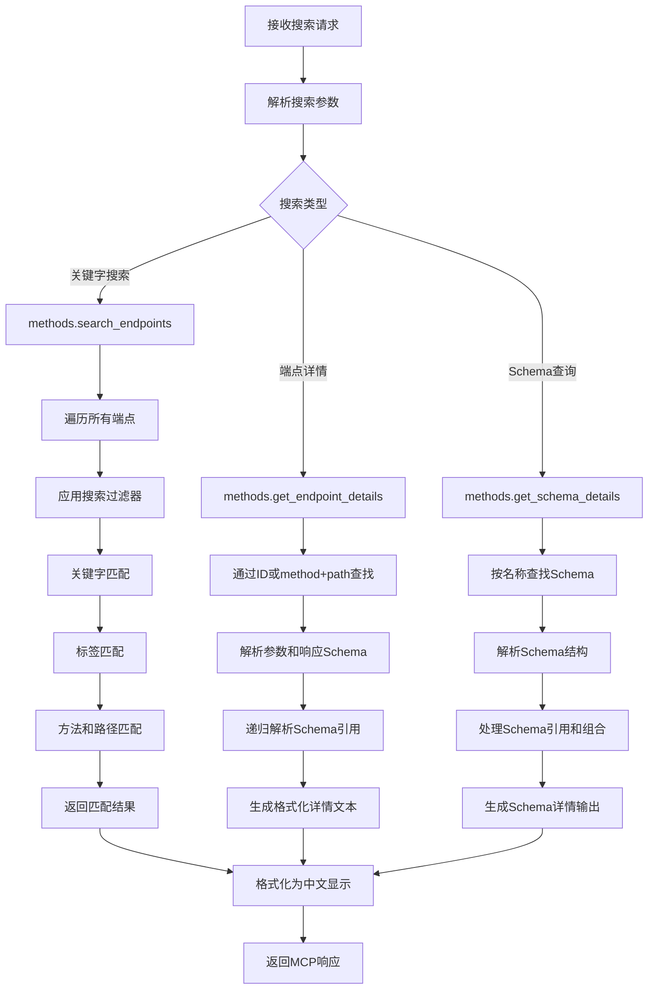

# Python3代码生成器设计文档

## 概述

本设计文档详细说明了在现有swagger2mcp工具中新增Python3代码生成器的完整技术方案。该生成器将遵循现有的Go和Node.js生成器的架构模式，生成符合MCP（Model Context Protocol）规范的Python服务器项目，支持JSON-RPC 2.0通信协议和标准输入输出传输机制。

### 设计目标
- 生成完整的Python MCP服务器项目
- 兼容Python 3.8+版本
- 遵循现代Python开发最佳实践
- 提供完整的开发工具链支持
- 与现有Go/Node.js生成器保持功能一致性

### 技术栈选择
- Python 3.8+（确保广泛兼容性）
- 标准库dataclasses（类型安全，无额外依赖）
- JSON-RPC 2.0 over stdio（MCP标准传输协议）
- Modern Python packaging（pyproject.toml + setup.py）
- pytest测试框架
- black格式化工具
- mypy静态类型检查

## 系统架构设计

### 系统架构图



### 数据流图



## 组件设计

### pyemitter包组件

#### Options结构体
```go
type Options struct {
    OutDir      string // 必需：目标输出目录
    ToolName    string // 工具名称，用于包名和入口点
    PackageName string // Python包名，默认从ToolName派生
    Force       bool   // 覆盖现有文件
    DryRun      bool   // 仅计划，不写入文件
    Verbose     bool   // 详细输出模式
}
```

**职责：**
- 封装Python代码生成器的配置参数
- 提供合理的默认值
- 支持与Go/Node.js生成器一致的参数

**接口：**
- 与generate.go中的GenerateConfig结构体映射
- 支持验证和标准化处理

**依赖：**
- 无外部依赖，纯数据结构

#### Emit函数
```go
func Emit(ctx context.Context, sm *genspec.ServiceModel, opts Options) (*Result, error)
```

**职责：**
- 作为Python代码生成器的主入口点
- 处理ServiceModel并生成完整的Python项目
- 管理文件生成和写入流程

**接口：**
- 接受Context用于取消操作
- 接受ServiceModel包含API规范数据
- 接受Options配置生成行为
- 返回Result包含生成的文件信息

**依赖：**
- genspec包（ServiceModel类型）
- 内部模板渲染函数

### Python项目核心组件

#### main.py - 程序入口
**职责：**
- 实现Python MCP服务器的标准输入输出协议
- 加载嵌入的ServiceModel数据
- 启动JSON-RPC 2.0消息处理循环

**关键功能：**
- stdin数据读取和JSON解析
- 消息路由到相应处理器
- 错误处理和进程生命周期管理

#### server.py - MCP服务器实现
**职责：**
- 实现完整的MCP协议消息处理
- 支持initialize、ping、tools/list、tools/call等标准方法
- 处理工具调用请求的路由和响应

**关键功能：**
- JSON-RPC 2.0协议兼容
- 工具定义和调用管理
- 结构化响应生成

#### spec/模块 - 数据模型和加载器
**职责：**
- 定义与Go/Node.js版本兼容的数据模型
- 实现ServiceModel的加载和解析
- 提供类型安全的数据访问

**组件：**
- `model.py`: dataclasses数据模型定义
- `loader.py`: JSON数据加载和解析
- `model.json`: 嵌入的ServiceModel数据

#### mcp/methods/模块 - MCP方法实现
**职责：**
- 实现所有标准MCP工具方法
- 提供API文档查询和搜索功能
- 支持中文本地化显示

**组件：**
- `__init__.py`: 方法导出
- `list_endpoints.py`: 端点列表和概览
- `search_endpoints.py`: 端点搜索
- `get_endpoint_details.py`: 端点详情查询
- `list_schemas.py`: Schema列表
- `get_schema_details.py`: Schema详情查询

## 数据模型设计

### 核心数据结构定义

```python
from dataclasses import dataclass
from typing import List, Dict, Optional, Any, Union

@dataclass
class Server:
    url: str
    description: str

@dataclass 
class SchemaRef:
    ref: str

@dataclass
class Schema:
    name: str
    type: str
    properties: Optional[Dict[str, 'SchemaOrRef']] = None
    required: Optional[List[str]] = None
    items: Optional['SchemaOrRef'] = None
    all_of: Optional[List['SchemaOrRef']] = None
    any_of: Optional[List['SchemaOrRef']] = None
    one_of: Optional[List['SchemaOrRef']] = None
    description: Optional[str] = None
    enum: Optional[List[Any]] = None
    format: Optional[str] = None
    example: Optional[Any] = None

@dataclass
class SchemaOrRef:
    schema: Optional[Schema] = None
    ref: Optional[SchemaRef] = None

@dataclass
class ParameterModel:
    name: str
    in_: str  # path|query|header|cookie
    required: bool
    schema: Optional[SchemaOrRef] = None

@dataclass
class Media:
    mime: str
    schema: Optional[SchemaOrRef] = None
    example: Optional[Any] = None

@dataclass
class RequestBodyModel:
    content: List[Media]
    required: bool

@dataclass
class ResponseModel:
    status: str
    description: str
    content: List[Media]

@dataclass
class EndpointModel:
    id: str
    method: str
    path: str
    summary: str
    description: str
    tags: List[str]
    parameters: List[ParameterModel]
    request_body: Optional[RequestBodyModel] = None
    responses: List[ResponseModel]

@dataclass
class ServiceModel:
    title: str
    version: str
    description: str
    servers: List[Server]
    tags: List[str]
    endpoints: List[EndpointModel]
    schemas: Dict[str, Schema]
```

### 数据模型图



## 业务流程设计

### 流程1：Python代码生成器初始化和文件生成



### 流程2：MCP服务器运行时消息处理



### 流程3：API端点搜索和详情查询



## 错误处理策略

### 分层错误处理架构

1. **CLI层错误处理**
   - 参数验证错误：返回使用提示和错误码
   - 文件系统错误：权限、磁盘空间、路径错误的友好提示
   - 配置错误：配置文件解析和验证错误

2. **生成器层错误处理**
   - ServiceModel验证：空指针、必需字段缺失
   - 模板渲染错误：模板语法错误、数据不匹配
   - 文件写入错误：原子写入失败的恢复机制

3. **运行时错误处理**
   - JSON-RPC协议错误：格式错误、方法不存在
   - 数据访问错误：ServiceModel加载失败、数据缺失
   - 工具调用错误：参数验证失败、执行异常

### 错误恢复机制

```python
# 示例：MCP服务器错误处理模式
def handle_tool_call(name: str, arguments: dict) -> dict:
    try:
        # 参数验证
        if not name or not isinstance(arguments, dict):
            return error_response(-32602, "Invalid parameters")
            
        # 工具执行
        result = execute_tool(name, arguments)
        return success_response(result)
        
    except ToolNotFoundError:
        return error_response(-32601, f"Tool not found: {name}")
    except ValidationError as e:
        return error_response(-32602, f"Parameter validation failed: {e}")
    except Exception as e:
        logger.exception(f"Tool execution failed: {e}")
        return error_response(-32000, "Internal server error")
```

## 测试策略

### 测试层级架构

1. **单元测试 (tests/unit/)**
   - 数据模型测试：dataclass序列化、验证
   - 工具方法测试：搜索、查询、格式化功能
   - 模板渲染测试：代码生成正确性

2. **集成测试 (tests/integration/)**
   - MCP协议测试：完整的请求-响应周期
   - ServiceModel加载测试：JSON解析和数据完整性
   - 文件生成测试：完整项目结构验证

3. **端到端测试 (tests/e2e/)**
   - CLI集成测试：从命令行到项目生成
   - 生成项目测试：生成项目的可运行性
   - 跨平台兼容性测试

### 测试用例设计

```python
# tests/test_mcp_methods.py示例结构
import pytest
from src.spec.loader import load_service_model
from src.mcp.methods import list_endpoints, search_endpoints

class TestMCPMethods:
    @pytest.fixture
    def service_model(self):
        return load_service_model()
    
    def test_list_endpoints_returns_overview(self, service_model):
        """测试端点列表功能返回正确的概览信息"""
        overview = list_endpoints.format_endpoints_overview(service_model)
        assert "API 接口概览" in overview
        assert len(overview) > 0
    
    def test_search_endpoints_with_keywords(self, service_model):
        """测试关键字搜索功能"""
        results = search_endpoints.search_endpoints(
            service_model, 
            {"keyword": "user", "method": "get"}
        )
        assert isinstance(results, list)
        for result in results:
            assert result["method"].lower() == "get"
    
    def test_endpoint_details_with_schema_resolution(self, service_model):
        """测试端点详情查询和Schema引用解析"""
        endpoints = service_model.endpoints
        if endpoints:
            endpoint = endpoints[0]
            formatted = get_endpoint_details.format_endpoint_details(
                endpoint, service_model
            )
            assert endpoint.method.upper() in formatted
            assert endpoint.path in formatted
```

### 性能测试考虑

- **内存使用**：大型API规范的ServiceModel加载和处理
- **启动时间**：Python解释器启动和模块导入优化  
- **响应时间**：复杂搜索和Schema解析的性能基准
- **并发处理**：多个MCP客户端同时连接的处理能力

## 集成策略

### CLI集成修改

#### generate.go文件修改点

1. **导入pyemitter包**
```go
import (
    pyemitter "github.com/mark3labs/swagger2mcp/internal/emitter/pyemitter"
)
```

2. **扩展语言验证逻辑**
```go
// 在(c *GenerateConfig) validate()方法中
switch c.Lang {
case "", "go", "npm", "python":  // 添加python支持
    if c.Lang == "" {
        c.Lang = "go"
    }
default:
    return newUsageError(fmt.Sprintf("generate: unsupported --lang %q (allowed: go, npm, python)", c.Lang))
}
```

3. **添加Python生成case分支**
```go
// 在runGenerate函数的switch语句中添加
case "python":
    res, err := pyemitter.Emit(ctx, sm, pyemitter.Options{
        OutDir:      outDir,
        ToolName:    resolvedToolName,
        PackageName: strings.TrimSpace(cfg.PackageName),
        Force:       cfg.Force,
        DryRun:      cfg.DryRun,
        Verbose:     cfg.Verbose,
    })
    if err != nil {
        return wrapOutputError(err, absOut)
    }
    if cfg.DryRun {
        printPlan(absOut, len(res.Planned), func() []string {
            paths := make([]string, 0, len(res.Planned))
            for _, p := range res.Planned {
                paths = append(paths, p.RelPath)
            }
            return paths
        }())
    }
```

4. **更新帮助文档**
```go
// 在newGenerateCmd函数的flag定义中
flags.String("lang", "", "Target language to emit (go|npm|python); defaults to go")
```

### 与现有架构的兼容性

1. **接口一致性**
   - Emit函数签名与goemitter/npmemitter保持一致
   - Options结构体字段语义对应
   - Result结构体格式兼容

2. **错误处理兼容**
   - 错误类型和包装方式与现有模式一致
   - wrapOutputError函数可直接使用
   - 用户友好的错误消息格式

3. **文件组织兼容**
   - 遵循internal/emitter/*emitter的目录结构
   - 模板函数命名规范一致
   - 测试文件组织结构对应

## 实现细节

### Python项目文件结构

```
生成的Python项目/
├── setup.py                    # 传统安装脚本，兼容性考虑
├── pyproject.toml              # 现代Python项目配置
├── requirements.txt            # 运行时依赖
├── requirements-dev.txt        # 开发依赖
├── README.md                   # 项目说明文档
├── .gitignore                  # Git忽略规则
├── .editorconfig              # 编辑器配置
├── Makefile                   # 开发任务自动化
├── src/
│   └── {工具名}/
│       ├── __init__.py
│       ├── main.py            # 程序入口点
│       ├── server.py          # MCP服务器实现
│       ├── spec/
│       │   ├── __init__.py
│       │   ├── model.py       # 数据模型定义
│       │   ├── loader.py      # ServiceModel加载器
│       │   └── model.json     # 嵌入的API规范数据
│       └── mcp/
│           ├── __init__.py
│           └── methods/
│               ├── __init__.py
│               ├── list_endpoints.py
│               ├── search_endpoints.py
│               ├── get_endpoint_details.py
│               ├── list_schemas.py
│               └── get_schema_details.py
└── tests/
    ├── __init__.py
    ├── test_mcp_methods.py    # MCP方法测试
    ├── test_data_models.py    # 数据模型测试
    └── test_integration.py   # 集成测试
```

### 现代Python配置最佳实践

#### pyproject.toml配置
```toml
[build-system]
requires = ["setuptools>=61.0", "wheel"]
build-backend = "setuptools.build_meta"

[project]
name = "{包名}"
version = "0.1.0"
description = "Generated MCP tool for {API标题}"
requires-python = ">=3.8"
dependencies = [
    "typing-extensions>=4.0.0; python_version<'3.9'",
]
dynamic = ["readme"]

[project.scripts]
{工具名} = "{包名}.main:main"

[tool.setuptools.dynamic]
readme = {file = ["README.md"], content-type = "text/markdown"}

[tool.black]
line-length = 88
target-version = ['py38']

[tool.mypy]
python_version = "3.8"
strict = true
warn_return_any = true
warn_unused_configs = true

[tool.pytest.ini_options]
testpaths = ["tests"]
python_files = ["test_*.py"]
python_functions = ["test_*"]
```

### 依赖管理策略

#### 最小化运行时依赖
- **核心功能**：仅使用Python标准库
- **类型注解**：使用typing_extensions兼容Python 3.8
- **避免重型依赖**：不使用pydantic、aiohttp等，保持轻量

#### 开发时依赖分离
```txt
# requirements-dev.txt
pytest>=7.0.0
black>=22.0.0
mypy>=1.0.0
pylint>=2.15.0
coverage>=6.0.0
```

### 代码质量保证

#### 静态类型检查支持
```python
# 兼容Python 3.8的类型注解示例
from __future__ import annotations
from typing import Dict, List, Optional, Union
from typing_extensions import TypedDict  # Python 3.8兼容

class EndpointSummary(TypedDict):
    id: str
    method: str
    path: str
    summary: str
    tags: List[str]
```

#### 代码格式化和Lint配置
- **Black**: 自动代码格式化，88字符行长度
- **MyPy**: 严格类型检查，Python 3.8兼容
- **Pylint**: 代码质量检查和最佳实践建议

### 跨平台兼容性

#### 路径处理
```python
# 使用pathlib确保跨平台兼容
from pathlib import Path
import json

def load_service_model() -> ServiceModel:
    """加载嵌入的ServiceModel，兼容所有平台路径"""
    model_path = Path(__file__).parent / "model.json"
    with model_path.open("r", encoding="utf-8") as f:
        data = json.load(f)
    return ServiceModel.from_dict(data)
```

#### 编码处理
```python
# 确保UTF-8编码处理
import sys
import json

# stdin/stdout编码配置
sys.stdin.reconfigure(encoding='utf-8')
sys.stdout.reconfigure(encoding='utf-8')
sys.stderr.reconfigure(encoding='utf-8')
```

## 性能优化考虑

### 启动时间优化
1. **延迟导入**：仅在需要时导入重型模块
2. **模块级缓存**：ServiceModel加载后缓存复用
3. **最小化依赖**：避免不必要的第三方库

### 内存使用优化
1. **数据结构选择**：dataclasses比dict更内存高效
2. **对象复用**：避免不必要的对象创建
3. **垃圾回收**：适当的对象生命周期管理

### 响应时间优化
1. **搜索算法**：使用索引和缓存优化频繁查询
2. **JSON序列化**：使用标准库json优化性能
3. **字符串处理**：优化格式化和模板渲染

这个设计文档提供了完整的Python3代码生成器实现蓝图，确保生成的代码质量高、兼容性好，并与现有系统完美集成。