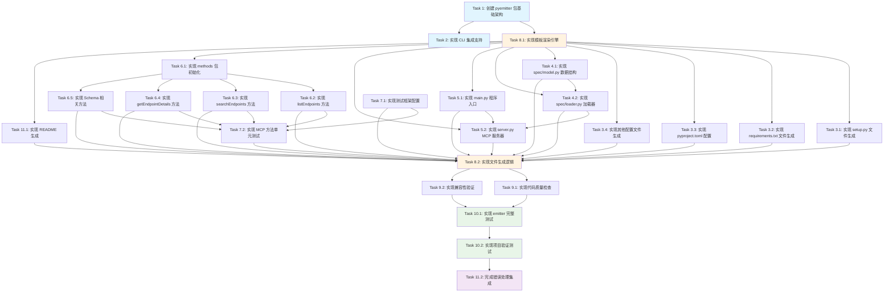

# Python3 代码生成器实施计划

## 概述

本实施计划定义了在 swagger2mcp 工具中实现 Python3 代码生成器的具体编码任务。计划遵循测试驱动开发原则，确保每个步骤都能增量构建和验证功能。

## 实施任务清单

- [x] 1. 创建 pyemitter 包基础架构
  - 在 `internal/emitter/pyemitter/` 目录下创建包结构
  - 实现 `emitter.go` 文件，定义 Options、Result、PlannedFile 结构体
  - 实现 Emit 函数的基本接口框架
  - _需求: 1.1, 1.2, 1.3, 1.4_
  - _文件路径: internal/emitter/pyemitter/emitter.go_

- [x] 2. 实现 CLI 集成支持
  - 更新 `internal/cli/generate.go` 中的语言验证逻辑，添加 "python" 选项
  - 在 runGenerate 函数中添加 python case 分支
  - 更新帮助文档，在 --lang 参数说明中包含 python 选项
  - _需求: 9.1, 9.2, 9.3, 9.4_
  - _文件路径: internal/cli/generate.go_

- [x] 3. 实现 Python 项目配置文件生成
- [x] 3.1 实现 setup.py 文件生成
  - 创建 setup.py 模板，包含项目基本信息和依赖声明
  - 实现动态包名和工具名替换
  - 添加 console_scripts 入口点配置
  - _需求: 3.1, 3.2, 3.5, 3.6, 3.7_
  - _文件路径: internal/emitter/pyemitter/emitter.go_

- [x] 3.2 实现 requirements.txt 和开发依赖文件生成
  - 生成运行时依赖 requirements.txt
  - 生成开发依赖 requirements-dev.txt
  - 确保包含 MCP 协议相关的 Python 库依赖
  - _需求: 3.3, 3.4_
  - _文件路径: internal/emitter/pyemitter/emitter.go_

- [x] 3.3 实现 pyproject.toml 现代 Python 配置
  - 生成符合 PEP 518 的 pyproject.toml 配置
  - 配置 black、mypy、pytest 等开发工具
  - 定义项目构建系统和脚本入口点
  - _需求: 7.1, 7.2, 7.3, 7.4_
  - _文件路径: internal/emitter/pyemitter/emitter.go_

- [x] 3.4 实现其他项目配置文件生成
  - 生成 Makefile，包含 install、test、format、lint、build 目标
  - 生成 Python 项目标准的 .gitignore 文件
  - 生成 .editorconfig 编辑器配置文件
  - _需求: 7.5, 7.6, 7.7_
  - _文件路径: internal/emitter/pyemitter/emitter.go_

- [x] 4. 实现 Python 数据模型定义
- [x] 4.1 实现 spec/model.py 数据结构定义
  - 定义 ServiceModel、EndpointModel、Schema 等核心数据类
  - 使用 dataclasses 和类型注解实现类型安全
  - 确保数据结构与 Go 和 Node.js 版本保持一致
  - _需求: 5.1, 5.2, 5.6_
  - _文件路径: internal/emitter/pyemitter/emitter.go_

- [x] 4.2 实现 spec/loader.py 服务模型加载器
  - 实现 load_service_model 函数，从嵌入的 model.json 加载数据
  - 添加数据加载错误处理和异常抛出
  - 实现 model.json 文件的嵌入机制
  - _需求: 5.3, 5.4, 5.5, 5.7_
  - _文件路径: internal/emitter/pyemitter/emitter.go_

- [x] 5. 实现 MCP 服务器核心组件
- [x] 5.1 实现 main.py 程序入口点
  - 创建控制台脚本入口点，支持标准输入输出通信
  - 初始化 MCP 服务器并处理命令行参数
  - 实现 Python 3.8+ 兼容的日志配置
  - _需求: 4.1, 10.1, 10.6_
  - _文件路径: internal/emitter/pyemitter/templates.go_

- [x] 5.2 实现 server.py MCP 服务器类
  - 实现 MCPServer 类，处理 JSON-RPC 2.0 协议消息
  - 支持 initialize、ping、tools/list、tools/call 等标准 MCP 方法
  - 实现工具调用路由和错误处理机制
  - _需求: 4.2, 4.3, 4.4, 4.5, 4.6, 4.7_
  - _文件路径: internal/emitter/pyemitter/templates.go_

- [x] 6. 实现 MCP 工具方法实现
- [x] 6.1 实现 methods/__init__.py 方法导出
  - 创建 methods 包初始化文件
  - 导出所有工具方法实现函数
  - _需求: 6.1_
  - _文件路径: internal/emitter/pyemitter/templates.go_

- [x] 6.2 实现 listEndpoints 方法
  - 实现 list_endpoints.py，提供 API 概览和统计信息
  - 支持格式化端点列表显示和中文本地化
  - 支持按方法、标签、路径分类统计
  - _需求: 6.2, 6.7_
  - _文件路径: internal/emitter/pyemitter/templates.go_

- [x] 6.3 实现 searchEndpoints 方法
  - 实现 search_endpoints.py，支持多种搜索模式
  - 实现关键字、标签、方法、路径模式搜索功能
  - 添加正则表达式路径匹配支持
  - _需求: 6.3, 6.7_
  - _文件路径: internal/emitter/pyemitter/templates.go_

- [x] 6.4 实现 getEndpointDetails 方法
  - 实现 get_endpoint_details.py，支持通过 ID 或 method+path 查找
  - 实现 Schema 引用解析和详细信息显示
  - 格式化参数、请求体、响应信息展示
  - _需求: 6.4, 6.7, 6.8_
  - _文件路径: internal/emitter/pyemitter/templates.go_

- [x] 6.5 实现 Schema 相关方法
  - 实现 list_schemas.py，返回所有 Schema 的摘要信息
  - 实现 get_schema_details.py，获取指定 Schema 的详细信息
  - 实现递归 Schema 引用解析功能
  - _需求: 6.5, 6.6, 6.8_
  - _文件路径: internal/emitter/pyemitter/templates.go_

- [x] 7. 实现测试文件生成
- [x] 7.1 实现基础测试框架和配置
  - 生成 tests/__init__.py 测试包初始化文件
  - 配置 pytest 测试运行环境
  - _需求: 8.6_
  - _文件路径: internal/emitter/pyemitter/templates.go_

- [x] 7.2 实现 MCP 方法单元测试
  - 生成 tests/test_mcp_methods.py，包含所有 MCP 方法的基本测试
  - 实现 test_list_and_search 函数，验证端点列表和搜索功能
  - 实现 test_schema_details 和 test_endpoint_details 函数
  - _需求: 8.1, 8.2, 8.3, 8.4, 8.5, 8.7_
  - _文件路径: internal/emitter/pyemitter/templates.go_

- [ ] 8. 实现模板渲染和文件生成系统
- [x] 8.1 实现模板数据结构和渲染引擎
  - 定义模板变量结构体，包含工具名、包名、服务模型等
  - 实现模板渲染函数，支持动态内容替换
  - 添加模板渲染错误处理
  - _需求: 所有需求的代码生成基础_
  - _文件路径: internal/emitter/pyemitter/templates.go_

- [x] 8.2 实现文件生成和写入逻辑
  - 实现目录结构创建逻辑
  - 实现文件原子写入，支持 Force 和 DryRun 模式
  - 添加文件权限和模式设置
  - _需求: 1.5, 9.6, 9.7_
  - _文件路径: internal/emitter/pyemitter/emitter.go_

- [ ] 9. 实现代码质量和兼容性保证
- [ ] 9.1 实现 Python 代码质量检查
  - 确保生成的代码符合 PEP 8 规范
  - 添加适当的类型注解和文档字符串
  - 实现适当的异常处理和日志记录
  - _需求: 10.2, 10.3, 10.4, 10.5, 10.6_
  - _文件路径: internal/emitter/pyemitter/templates.go_

- [ ] 9.2 实现 Python 3.8+ 兼容性验证
  - 确保所有代码兼容 Python 3.8 及以上版本
  - 使用标准库类型而非第三方依赖
  - 避免使用过新的语言特性
  - _需求: 10.1, 10.7, 10.8_
  - _文件路径: internal/emitter/pyemitter/templates.go_

- [ ] 10. 集成测试和验证
- [ ] 10.1 实现 pyemitter.Emit 函数完整测试
  - 编写 emitter_test.go，测试完整的生成流程
  - 验证所有必需文件的生成
  - 测试 DryRun 模式的正确性
  - _需求: 1.1, 1.2, 1.3, 1.4, 1.5, 9.6_
  - _文件路径: internal/emitter/pyemitter/emitter_test.go_

- [ ] 10.2 实现生成的 Python 项目验证测试
  - 验证生成的 Python 项目结构完整性
  - 验证 setup.py 和依赖配置的正确性
  - 确保生成的代码可以正常导入和运行
  - _需求: 2.1, 2.2, 2.3, 2.4, 2.5, 2.6, 2.7_
  - _文件路径: internal/emitter/pyemitter/emitter_test.go_

- [x] 11. 项目文档和示例生成
- [x] 11.1 实现 README.md 生成
  - 生成项目 README.md，包含安装和使用说明
  - 添加 MCP 工具的使用示例
  - 包含开发环境配置指南
  - _需求: 2.1_
  - _文件路径: internal/emitter/pyemitter/templates.go_

- [x] 11.2 完成错误处理和日志集成
  - 实现完整的错误处理策略
  - 添加详细的日志输出支持
  - 确保错误信息与 Go/Node.js 版本格式一致
  - _需求: 9.5, 9.7_
  - _文件路径: internal/emitter/pyemitter/emitter.go_

## 任务依赖关系图

